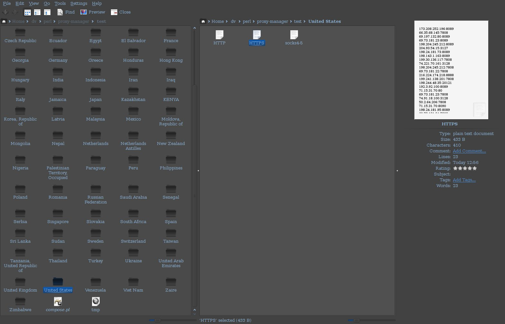

proxy-manager
=============

A script for crawling a popular proxy listing site and deobfuscating the HTML source.

The site url is included in the source code.

Perl::LWP is used to download each listing page, then deobfuscation is done on the HTML source pages to extract the proxy credentials. The obfuscation takes the following form:

         <td>36
36
116127
127
.
169
228.55.8
8
107
107
217</td>	
             <td>
    8003</td>

It is very difficult to parse out the correct information from this data (as I found out first hand). The most efficient way of solving this problem is to parse out the *incorrect* information until only the correct values remain.i.e. Delete all tags which are marked display:none, delete all tags which are members of a class with the attribute display:none, and so on.

The proxies are split up into directories based on their country of origin and then into separate files based on their protocol (HTTP, HTTPS and socks). Each file is formatted with one set of proxy credentials per line. The IP address is in decimal form with each oclet delimited by a period. A colon separates the address from the port number in accordance with convention.

Below is a screenshot showing the output directory and file structure.

